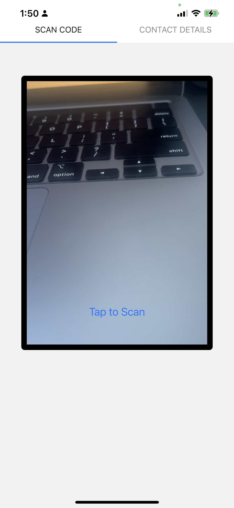
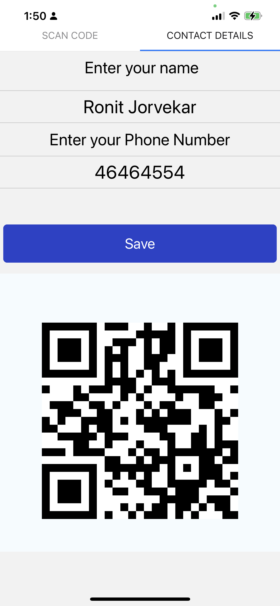

# ShareCon 

A simple QR code based Mobile App to exchange contacts effortlessly.

## Install expo and required dependencies.
`npm install`
## Run using expo start command.
`expo start`

## Steps to follow:

1) Edit your personal details in the second tab.
2) Press the save button and a QR code with your contact details will be generated.
3) Go the the Scan tab
4) Scan codes to save contacts from other apps.
5) Show your QR code to effortlessly store your contact in your friend's app.

### Screenshots:
<table>
<row>

</row>
<row>

<row>
</table>